# Visual Aids — FizzBuzzEnterpriseEdition Refactor Experiment
**Document ID:** VISUAL_AIDS_INITIAL
**Branch:** `ai-refactor-experiment`
**Sources:** REQUIREMENTS_REFINED_1.md, PLAN_REVISED_1.md, source code (pre-refactor)
**Rendering note:** All Mermaid blocks render as diagrams in GitHub, GitLab, VS Code with the Mermaid Preview extension, and any Markdown viewer with Mermaid support. The raw Mermaid source code is the block itself.

---

## Table of Contents

1. [Pre-Refactor System](#1-pre-refactor-system)
   - 1.1 UML Class Diagrams
   - 1.2 Use Cases
   - 1.3 Sequence Diagrams
2. [Post-Refactor System](#2-post-refactor-system)
   - 2.1 UML Class Diagram
   - 2.2 Use Cases
   - 2.3 Sequence Diagram
3. [Architectural Comparison](#3-architectural-comparison)

---

## 1. Pre-Refactor System

The pre-refactor system contains **87 Java source files** (26 interfaces + 61 concrete classes), organized across a 7-level-deep package hierarchy under `com.seriouscompany.business.java.fizzbuzz.packagenamingpackage`. It uses Spring Framework 3.2.13 for dependency injection and implements 8+ GoF design patterns. All diagrams in this section reflect the code on the `uinverse` branch.

---

### 1.1 UML Class Diagrams

Two diagrams are provided: a high-level architecture overview covering the full execution spine, and a detail diagram focused on the printer and output sub-system.

#### 1.1.1 Architecture Overview

This diagram shows all major interfaces and classes involved in the execution path, grouped by architectural layer. Factory classes (15 total) are represented by a single representative example; the remaining 14 are noted. The full package prefix `com.seriouscompany.business.java.fizzbuzz.packagenamingpackage` is omitted for readability.

```mermaid
classDiagram
    direction TB

    %% ══════════════════════════════
    %% LAYER 1 — ENTRY POINT
    %% ══════════════════════════════
    class Main {
        +main(String[] args)$
    }
    class FizzBuzz {
        <<interface>>
        +fizzBuzz(int n)
    }
    class StandardFizzBuzz {
        -_fizzBuzzSolutionStrategyFactory
        +fizzBuzz(int n)
    }

    %% ══════════════════════════════
    %% LAYER 2 — SOLUTION STRATEGY
    %% ══════════════════════════════
    class FizzBuzzSolutionStrategyFactory {
        <<interface>>
        +createFizzBuzzSolutionStrategy()
    }
    class FizzBuzzSolutionStrategy {
        <<interface>>
        +runSolution(int n)
    }
    class EnterpriseGradeFizzBuzzSolutionStrategy {
        -_loopPayloadExecution
        +runSolution(int n)
    }

    %% ══════════════════════════════
    %% LAYER 3 — LOOP
    %% ══════════════════════════════
    class LoopContextStateManipulation {
        <<interface>>
        +start()
        +shouldProceed() bool
        +proceed()
    }
    class LoopContextStateRetrieval {
        <<interface>>
        +getControlParameter() int
    }
    class LoopContext {
        -myCurrentControlParameterValue int
        +start()
        +shouldProceed() bool
        +proceed()
        +getControlParameter() int
    }
    class LoopRunner {
        -myStateManipulation
        -myStateRetrieval
        -myPayload
        +runLoop()
    }
    class LoopPayloadExecution {
        <<interface>>
        +runLoopPayload(LoopContextStateRetrieval)
    }

    %% ══════════════════════════════
    %% LAYER 4 — PAYLOAD / ADAPTER
    %% ══════════════════════════════
    class SingleStepPayload {
        -_outputGenerationStrategy
        +runLoopPayload(LoopContextStateRetrieval)
    }
    class SingleStepOutputGenerationParameter {
        <<interface>>
        +retrieveIntegerValue() int
    }
    class LoopContextStateRetrievalAdapter {
        +retrieveIntegerValue() int
    }

    %% ══════════════════════════════
    %% LAYER 5 — OUTPUT GENERATION
    %% ══════════════════════════════
    class OutputGenerationStrategy {
        <<interface>>
        +performGenerationForCurrentStep(param)
    }
    class SingleStepOutputGenerationStrategy {
        -contexts List~OutputGenerationContext~
        -contextVisitor
        -myNewLinePrinter
        +performGenerationForCurrentStep(param)
    }

    %% ══════════════════════════════
    %% LAYER 6 — VISITOR PATTERN
    %% ══════════════════════════════
    class OutputGenerationContextVisitor {
        <<interface>>
        +visit(OutputGenerationContext, int)
    }
    class FizzBuzzOutputGenerationContextVisitor {
        +visit(OutputGenerationContext, int)
    }
    class OutputGenerationContext {
        <<interface>>
        +getStrategy() IsEvenlyDivisibleStrategy
        +getPrinter() DataPrinter
    }
    class FizzBuzzOutputGenerationContext {
        -strategy IsEvenlyDivisibleStrategy
        -printer DataPrinter
        +getStrategy()
        +getPrinter()
    }

    %% ══════════════════════════════
    %% LAYER 7 — DIVISIBILITY STRATEGIES
    %% ══════════════════════════════
    class IsEvenlyDivisibleStrategy {
        <<interface>>
        +isEvenlyDivisible(int) bool
    }
    class FizzStrategy {
        +isEvenlyDivisible(int) bool
    }
    class BuzzStrategy {
        +isEvenlyDivisible(int) bool
    }
    class NoFizzNoBuzzStrategy {
        +isEvenlyDivisible(int) bool
    }

    %% ══════════════════════════════
    %% LAYER 8 — PRINTERS
    %% ══════════════════════════════
    class DataPrinter {
        <<interface>>
        +print()
        +printValue(Object)
    }
    class StringPrinter {
        <<interface>>
        +print()
    }
    class IntegerPrinter {
        <<interface>>
        +printInteger(int)
    }
    class FizzStringPrinter {
        +print()
        +printValue(Object)
    }
    class BuzzStringPrinter {
        +print()
        +printValue(Object)
    }
    class NewLineStringPrinter {
        +print()
        +printValue(Object)
    }
    class IntegerIntegerPrinter {
        +printInteger(int)
        +printValue(Object)
        +print() throws UnsupportedOp
    }

    %% ══════════════════════════════
    %% LAYER 9 — MATH
    %% ══════════════════════════════
    class NumberIsMultipleOfAnotherNumberVerifier {
        -integerDivider$ IntegerDivider
        +numberIsMultipleOfAnotherNumber(int,int)$ bool
        +init()
    }
    class IntegerDivider {
        +divide(int, int) int
    }
    class ApplicationContextHolder {
        -applicationContext ApplicationContext
        +getApplicationContext() ApplicationContext
    }

    %% ══════════════════════════════
    %% LAYER 10 — OUTPUT CHANNEL
    %% ══════════════════════════════
    class FizzBuzzOutputStrategy {
        <<interface>>
        +output(String)
    }
    class FizzBuzzExceptionSafeOutputStrategy {
        <<interface>>
        +output(String)
    }
    class SystemOutFizzBuzzOutputStrategy {
        +output(String)
    }
    class FizzBuzzOutputStrategyAdapter {
        +output(String)
    }

    %% ══════════════════════════════════════════
    %% RELATIONSHIPS
    %% ══════════════════════════════════════════

    %% Entry → Strategy
    Main --> FizzBuzz : gets bean via Spring
    StandardFizzBuzz ..|> FizzBuzz
    StandardFizzBuzz --> FizzBuzzSolutionStrategyFactory : uses
    StandardFizzBuzz --> FizzBuzzSolutionStrategy : creates via factory

    %% Solution Strategy → Loop
    EnterpriseGradeFizzBuzzSolutionStrategy ..|> FizzBuzzSolutionStrategy
    EnterpriseGradeFizzBuzzSolutionStrategy --> LoopContext : creates
    EnterpriseGradeFizzBuzzSolutionStrategy --> LoopRunner : creates

    %% Loop internal
    LoopContext ..|> LoopContextStateManipulation
    LoopContext ..|> LoopContextStateRetrieval
    LoopContext ..> ApplicationContextHolder : 2nd Spring ctx ⚠
    LoopRunner --> LoopContextStateManipulation : controls via
    LoopRunner --> LoopContextStateRetrieval : reads via
    LoopRunner --> LoopPayloadExecution : executes each step

    %% Payload
    SingleStepPayload ..|> LoopPayloadExecution
    SingleStepPayload --> OutputGenerationStrategy : delegates to
    SingleStepPayload --> LoopContextStateRetrievalAdapter : creates

    %% Adapter
    LoopContextStateRetrievalAdapter ..|> SingleStepOutputGenerationParameter
    LoopContextStateRetrievalAdapter --> LoopContextStateRetrieval : adapts

    %% Output generation
    SingleStepOutputGenerationStrategy ..|> OutputGenerationStrategy
    SingleStepOutputGenerationStrategy "1" --> "3" FizzBuzzOutputGenerationContext : holds
    SingleStepOutputGenerationStrategy --> FizzBuzzOutputGenerationContextVisitor : uses
    SingleStepOutputGenerationStrategy --> NewLineStringPrinter : newline after each step

    %% Visitor
    FizzBuzzOutputGenerationContextVisitor ..|> OutputGenerationContextVisitor
    FizzBuzzOutputGenerationContext ..|> OutputGenerationContext
    FizzBuzzOutputGenerationContext --> IsEvenlyDivisibleStrategy : holds
    FizzBuzzOutputGenerationContext --> DataPrinter : holds

    %% Divisibility
    FizzStrategy ..|> IsEvenlyDivisibleStrategy
    BuzzStrategy ..|> IsEvenlyDivisibleStrategy
    NoFizzNoBuzzStrategy ..|> IsEvenlyDivisibleStrategy
    FizzStrategy --> NumberIsMultipleOfAnotherNumberVerifier : uses static
    BuzzStrategy --> NumberIsMultipleOfAnotherNumberVerifier : uses static
    NoFizzNoBuzzStrategy --> NumberIsMultipleOfAnotherNumberVerifier : uses static
    NumberIsMultipleOfAnotherNumberVerifier --> IntegerDivider : uses
    NumberIsMultipleOfAnotherNumberVerifier --> ApplicationContextHolder : service locator

    %% Printer hierarchy
    StringPrinter --|> DataPrinter
    IntegerPrinter --|> DataPrinter
    FizzStringPrinter ..|> StringPrinter
    BuzzStringPrinter ..|> StringPrinter
    NewLineStringPrinter ..|> StringPrinter
    IntegerIntegerPrinter ..|> IntegerPrinter

    %% Output channel
    SystemOutFizzBuzzOutputStrategy ..|> FizzBuzzOutputStrategy
    FizzBuzzOutputStrategyAdapter ..|> FizzBuzzExceptionSafeOutputStrategy
    FizzBuzzOutputStrategyAdapter --> FizzBuzzOutputStrategy : wraps
    FizzStringPrinter --> FizzBuzzOutputStrategyAdapter : creates & uses
    BuzzStringPrinter --> FizzBuzzOutputStrategyAdapter : creates & uses
    IntegerIntegerPrinter --> FizzBuzzOutputStrategyAdapter : creates & uses
```
(DY): The above class diagram is very dense and difficult to follow. However, it probably needs to be retained to get the full picture of the system. It would be good to generate additional diagrams, one for each of the identified layers of the architecture.

> **Diagram notes:**
> - ⚠ `LoopContext` bootstraps a **second independent Spring `ApplicationContext`** at construction time to retrieve its loop components, then immediately closes it. This is the Service Locator anti-pattern applied within an already-DI-managed object.
> - 15 factory classes are not shown. All follow the same pattern: `@Service`, constructor-inject their dependencies, implement a factory interface, and `new` their product. `FizzBuzzSolutionStrategyFactory` (shown) is a representative example.
> - `FizzBuzzOutputStrategyAdapter` is the shortened name for `FizzBuzzOutputStrategyToFizzBuzzExceptionSafeOutputStrategyAdapter`.
> - `LoopContextStateRetrievalAdapter` is the shortened name for `LoopContextStateRetrievalToSingleStepOutputGenerationAdapter`.

---

#### 1.1.2 Printer & Output Chain Detail

This diagram focuses on how a token string travels from a divisibility decision to bytes on `System.out` — the most deeply nested sub-system.

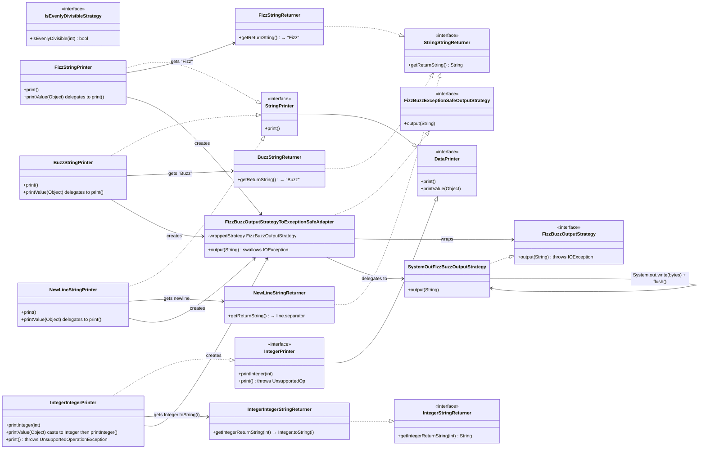

---

### 1.2 Use Cases

#### 1.2.1 Use Case Inventory

| ID | Use Case | Primary Actor | Preconditions | Postconditions | Notes |
|----|----------|--------------|---------------|----------------|-------|
| UC-01 | Run FizzBuzz (1..100) | User/Operator | JRE available; JAR on filesystem | FizzBuzz output for 1–100 written to stdout | Invoked via `java -jar` |
| UC-02 | Run FizzBuzz for arbitrary N | Developer / Test caller | Spring context active | FizzBuzz output for 1–N written to stdout | Invoked via `StandardFizzBuzz.fizzBuzz(N)` |
| UC-03 | Validate FizzBuzz correctness | Automated Test Harness | Spring context available; System.out redirected | All 16 assertions pass; System.out restored | `FizzBuzzTest.testFizzBuzz()` |
| UC-04 | Add a new FizzBuzz rule (e.g., "Bazz" for multiples of 7) | Developer | Existing codebase | New rule produces correct output without modifying existing classes | Enabled by Strategy + Factory + Visitor patterns; complies with Open/Closed Principle |

#### 1.2.2 Use Case Diagram

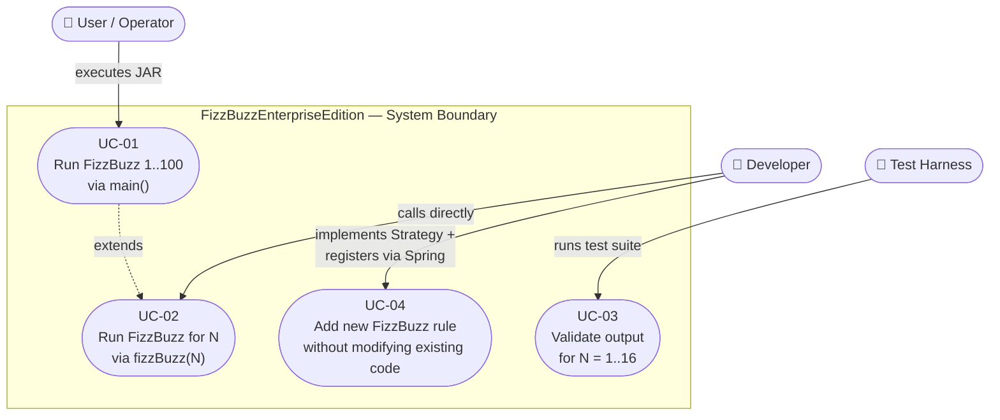
(DY): In the rendering of the graph defined immediately above, the `Developer` and `Test Harness` entries display on the far right side of the `System Boundary`, but this makes the graph excessively wide. Let's move those to be rendered above the `System Boundary` box, to the right of where `User/Operator` is located.

---

### 1.3 Sequence Diagrams

#### 1.3.1 Full Execution Flow

This diagram traces the complete call chain from `main()` through Spring context setup, solution strategy delegation, loop execution, and final output to `System.out`.

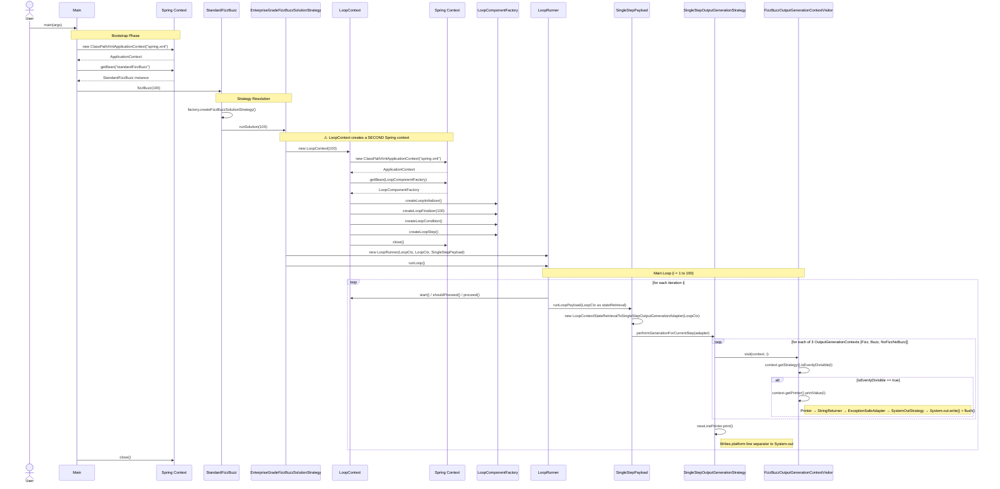

---

#### 1.3.2 Per-Iteration Step Detail

This diagram zooms into a single iteration (e.g., i = 15, which produces "FizzBuzz") and shows the full call chain through divisibility checking, string retrieval, and output writing.

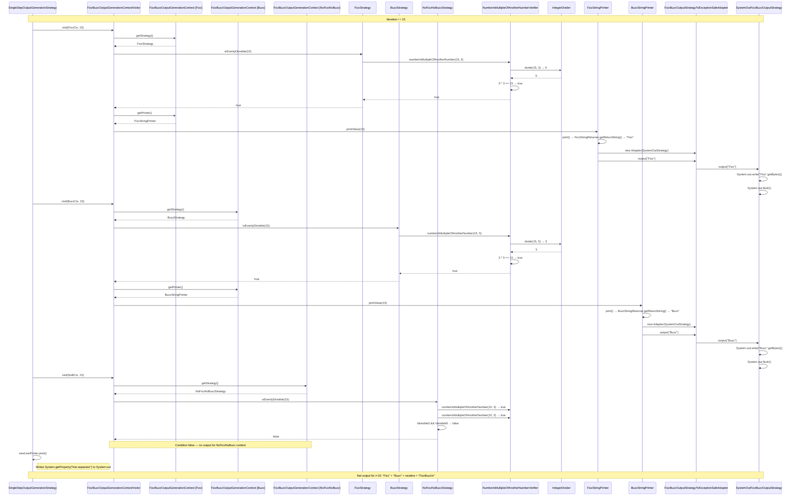

---

## 2. Post-Refactor System

The post-refactor system contains **1 Java source file** (`FizzBuzz.java`) with no external framework dependencies. The entire logic fits in a single `static` method. All diagrams in this section reflect the planned implementation described in PLAN_REVISED_1.md.

---

### 2.1 UML Class Diagram

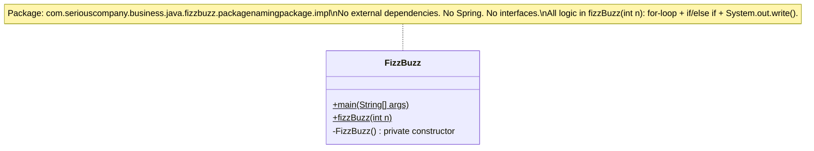

---

### 2.2 Use Cases

#### 2.2.1 Use Case Inventory

| ID | Use Case | Primary Actor | Preconditions | Postconditions | Change from Pre-Refactor |
|----|----------|--------------|---------------|----------------|--------------------------|
| UC-01 | Run FizzBuzz (1..100) | User/Operator | JRE available; JAR on filesystem | FizzBuzz output for 1–100 written to stdout | None — same behavior |
| UC-02 | Run FizzBuzz for arbitrary N | Developer / Test caller | None (no framework required) | FizzBuzz output for 1–N written to stdout | Simpler: direct `FizzBuzz.fizzBuzz(N)` static call |
| UC-03 | Validate FizzBuzz correctness | Automated Test Harness | System.out redirected | All 16 assertions pass; System.out restored | Spring context startup eliminated; test is faster |
| ~~UC-04~~ | ~~Add a new FizzBuzz rule without modifying existing code~~ | ~~Developer~~ | — | — | **Removed.** No longer supported. Adding a rule now requires modifying the `if/else if` chain in `fizzBuzz()`. |

#### 2.2.2 Use Case Diagram

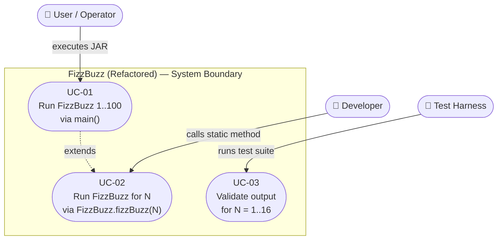

> **UC-04 removed.** The Open/Closed extensibility afforded by the Strategy pattern (pre-refactor) does not exist in the post-refactor. Adding a new rule (e.g., "Bazz" for multiples of 7) requires editing `FizzBuzz.java`. This is the primary extensibility trade-off documented in REQUIREMENTS_REFINED_1.md Section 5.

---

### 2.3 Sequence Diagram

#### 2.3.1 Full Execution Flow

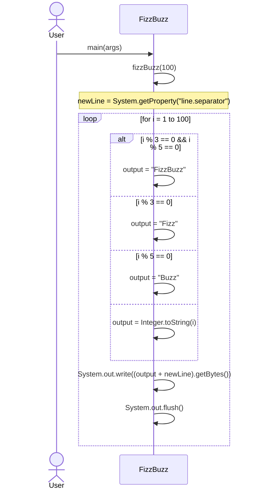

---

#### 2.3.2 Per-Iteration Step Detail (i = 15)

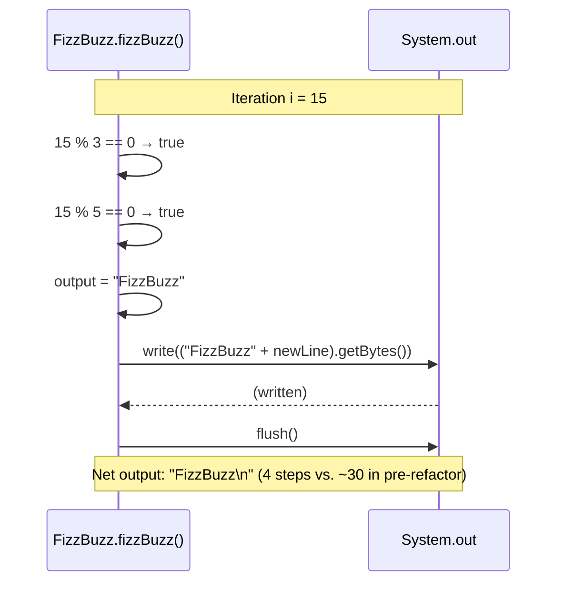
(DY): The `Note over` statement clips outside the rectangle it is placed inside. Can this be fixed?

---

## 3. Architectural Comparison

### 3.1 Structural Contrast

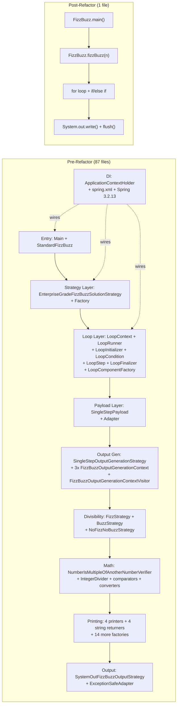

### 3.2 Pattern Inventory Comparison

| Pattern | Pre-Refactor | Post-Refactor |
|---------|-------------|---------------|
| Strategy | 7 implementations (FizzBuzzSolutionStrategy, IsEvenlyDivisibleStrategy, OutputGenerationStrategy, FizzBuzzOutputStrategy, FizzBuzzExceptionSafeOutputStrategy, LoopPayloadExecution, SingleStepOutputGenerationParameter) | 0 |
| Factory | 15 factory classes | 0 |
| Visitor | FizzBuzzOutputGenerationContextVisitor visits 3 OutputGenerationContexts | 0 |
| Adapter | 2 adapters (ExceptionSafe output, LoopContextRetrieval→SingleStepParam) | 0 |
| Dependency Injection | Spring 3.2.13 (@Service, @Autowired, spring.xml) | 0 |
| Service Locator (anti-pattern) | ApplicationContextHolder + 2nd Spring context in LoopContext | 0 |
| Template Method | LoopRunner's for-loop template (init/condition/step/finalize) | 0 |
| Comparator | ThreeWayIntegerComparator, IntegerForEqualityComparator, double comparators | 0 |
| **Total named patterns** | **8+** | **0** |

### 3.3 Call Depth Comparison (for a single output token, e.g., "Fizz")

```mermaid
graph TD
    subgraph pre2 ["Pre-Refactor call depth: ~14 frames"]
        A1["main()"] --> A2["fizzBuzz(n)"] --> A3["runSolution(n)"] --> A4["runLoop()"]
        A4 --> A5["runLoopPayload(stateRetrieval)"]
        A5 --> A6["performGenerationForCurrentStep(adapter)"]
        A6 --> A7["visit(context, i)"]
        A7 --> A8["isEvenlyDivisible(i)"]
        A8 --> A9["numberIsMultipleOfAnotherNumber(i, 3)"]
        A9 --> A10["divide(i, 3)"]
        A10 --> A11["printValue(i)"] --> A12["print()"]
        A12 --> A13["output(string)"] --> A14["System.out.write(bytes)"]
    end

    subgraph post2 ["Post-Refactor call depth: 3 frames"]
        B1["main()"] --> B2["fizzBuzz(n)"] --> B3["System.out.write(bytes)"]
    end
```

(DY): I do not see anything in the above diagrams that links the requirements (from REQUIREMENTS_REFINED_1.md) to any generated graphs. This means that I have no way of tracing whether requirements are satisfied as part of the visual design artifacts. This is traceability needs to be added.
