# Visual Aids — FizzBuzzEnterpriseEdition Refactor Experiment
**Document ID:** VISUAL_AIDS_REFINED_1
**Supersedes:** VISUAL_AIDS_INITIAL
**Branch:** `ai-refactor-experiment`
**Sources:** REQUIREMENTS_REFINED_1.md, PLAN_REVISED_1.md, VISUAL_AIDS_INITIAL.md (with DY annotations)
**Rendering note:** All Mermaid blocks render in GitHub, GitLab, VS Code (Mermaid Preview), and any Markdown viewer with Mermaid support.

---

## Table of Contents

1. [Pre-Refactor System](#1-pre-refactor-system)
   - 1.1 UML Class Diagrams
     - 1.1.1 Architecture Overview
     - 1.1.2 Per-Layer Class Diagrams (Layers 1–10)
     - 1.1.3 Printer & Output Chain Detail
   - 1.2 Use Cases
   - 1.3 Sequence Diagrams
2. [Post-Refactor System](#2-post-refactor-system)
   - 2.1 UML Class Diagram
   - 2.2 Use Cases
   - 2.3 Sequence Diagrams
3. [Architectural Comparison](#3-architectural-comparison)
4. [Requirements Traceability Matrix](#4-requirements-traceability-matrix)
5. [Unrepresented Requirements](#5-unrepresented-requirements)
6. [Change Log from VISUAL_AIDS_INITIAL](#6-change-log-from-visual_aids_initial)

---

## 1. Pre-Refactor System

The pre-refactor system contains **87 Java source files** (26 interfaces + 61 concrete classes), organized across a 7-level-deep package hierarchy under `com.seriouscompany.business.java.fizzbuzz.packagenamingpackage`. It uses Spring Framework 3.2.13 for dependency injection and implements 8+ GoF design patterns. All diagrams in this section reflect the code on the `uinverse` branch.

---

### 1.1 UML Class Diagrams

#### 1.1.1 Architecture Overview

This diagram shows all major interfaces and classes involved in the execution path, grouped by architectural layer. The diagram is intentionally comprehensive; see §1.1.2 for focused per-layer views. Factory classes (15 total) are represented by a single representative example. The full package prefix `com.seriouscompany.business.java.fizzbuzz.packagenamingpackage` is omitted.

```mermaid
classDiagram
    direction TB

    %% ══════════════════════════════
    %% LAYER 1 — ENTRY POINT
    %% ══════════════════════════════
    class Main {
        +main(String[] args)$
    }
    class FizzBuzz {
        <<interface>>
        +fizzBuzz(int n)
    }
    class StandardFizzBuzz {
        -_fizzBuzzSolutionStrategyFactory
        +fizzBuzz(int n)
    }

    %% ══════════════════════════════
    %% LAYER 2 — SOLUTION STRATEGY
    %% ══════════════════════════════
    class FizzBuzzSolutionStrategyFactory {
        <<interface>>
        +createFizzBuzzSolutionStrategy()
    }
    class FizzBuzzSolutionStrategy {
        <<interface>>
        +runSolution(int n)
    }
    class EnterpriseGradeFizzBuzzSolutionStrategy {
        -_loopPayloadExecution
        +runSolution(int n)
    }

    %% ══════════════════════════════
    %% LAYER 3 — LOOP
    %% ══════════════════════════════
    class LoopContextStateManipulation {
        <<interface>>
        +start()
        +shouldProceed() bool
        +proceed()
    }
    class LoopContextStateRetrieval {
        <<interface>>
        +getControlParameter() int
    }
    class LoopContext {
        -myCurrentControlParameterValue int
        +start()
        +shouldProceed() bool
        +proceed()
        +getControlParameter() int
    }
    class LoopRunner {
        -myStateManipulation
        -myStateRetrieval
        -myPayload
        +runLoop()
    }
    class LoopPayloadExecution {
        <<interface>>
        +runLoopPayload(LoopContextStateRetrieval)
    }

    %% ══════════════════════════════
    %% LAYER 4 — PAYLOAD / ADAPTER
    %% ══════════════════════════════
    class SingleStepPayload {
        -_outputGenerationStrategy
        +runLoopPayload(LoopContextStateRetrieval)
    }
    class SingleStepOutputGenerationParameter {
        <<interface>>
        +retrieveIntegerValue() int
    }
    class LoopContextStateRetrievalAdapter {
        +retrieveIntegerValue() int
    }

    %% ══════════════════════════════
    %% LAYER 5 — OUTPUT GENERATION
    %% ══════════════════════════════
    class OutputGenerationStrategy {
        <<interface>>
        +performGenerationForCurrentStep(param)
    }
    class SingleStepOutputGenerationStrategy {
        -contexts List~OutputGenerationContext~
        -contextVisitor
        -myNewLinePrinter
        +performGenerationForCurrentStep(param)
    }

    %% ══════════════════════════════
    %% LAYER 6 — VISITOR PATTERN
    %% ══════════════════════════════
    class OutputGenerationContextVisitor {
        <<interface>>
        +visit(OutputGenerationContext, int)
    }
    class FizzBuzzOutputGenerationContextVisitor {
        +visit(OutputGenerationContext, int)
    }
    class OutputGenerationContext {
        <<interface>>
        +getStrategy() IsEvenlyDivisibleStrategy
        +getPrinter() DataPrinter
    }
    class FizzBuzzOutputGenerationContext {
        -strategy IsEvenlyDivisibleStrategy
        -printer DataPrinter
        +getStrategy()
        +getPrinter()
    }

    %% ══════════════════════════════
    %% LAYER 7 — DIVISIBILITY STRATEGIES
    %% ══════════════════════════════
    class IsEvenlyDivisibleStrategy {
        <<interface>>
        +isEvenlyDivisible(int) bool
    }
    class FizzStrategy {
        +isEvenlyDivisible(int) bool
    }
    class BuzzStrategy {
        +isEvenlyDivisible(int) bool
    }
    class NoFizzNoBuzzStrategy {
        +isEvenlyDivisible(int) bool
    }

    %% ══════════════════════════════
    %% LAYER 8 — PRINTERS
    %% ══════════════════════════════
    class DataPrinter {
        <<interface>>
        +print()
        +printValue(Object)
    }
    class StringPrinter {
        <<interface>>
        +print()
    }
    class IntegerPrinter {
        <<interface>>
        +printInteger(int)
    }
    class FizzStringPrinter {
        +print()
        +printValue(Object)
    }
    class BuzzStringPrinter {
        +print()
        +printValue(Object)
    }
    class NewLineStringPrinter {
        +print()
        +printValue(Object)
    }
    class IntegerIntegerPrinter {
        +printInteger(int)
        +printValue(Object)
        +print() throws UnsupportedOp
    }

    %% ══════════════════════════════
    %% LAYER 9 — MATH
    %% ══════════════════════════════
    class NumberIsMultipleOfAnotherNumberVerifier {
        -integerDivider$ IntegerDivider
        +numberIsMultipleOfAnotherNumber(int,int)$ bool
        +init()
    }
    class IntegerDivider {
        +divide(int, int) int
    }
    class ApplicationContextHolder {
        -applicationContext ApplicationContext
        +getApplicationContext() ApplicationContext
    }

    %% ══════════════════════════════
    %% LAYER 10 — OUTPUT CHANNEL
    %% ══════════════════════════════
    class FizzBuzzOutputStrategy {
        <<interface>>
        +output(String)
    }
    class FizzBuzzExceptionSafeOutputStrategy {
        <<interface>>
        +output(String)
    }
    class SystemOutFizzBuzzOutputStrategy {
        +output(String)
    }
    class FizzBuzzOutputStrategyAdapter {
        +output(String)
    }

    %% RELATIONSHIPS
    Main --> FizzBuzz : gets bean via Spring
    StandardFizzBuzz ..|> FizzBuzz
    StandardFizzBuzz --> FizzBuzzSolutionStrategyFactory : uses
    StandardFizzBuzz --> FizzBuzzSolutionStrategy : creates via factory

    EnterpriseGradeFizzBuzzSolutionStrategy ..|> FizzBuzzSolutionStrategy
    EnterpriseGradeFizzBuzzSolutionStrategy --> LoopContext : creates
    EnterpriseGradeFizzBuzzSolutionStrategy --> LoopRunner : creates

    LoopContext ..|> LoopContextStateManipulation
    LoopContext ..|> LoopContextStateRetrieval
    LoopContext ..> ApplicationContextHolder : 2nd Spring ctx ⚠
    LoopRunner --> LoopContextStateManipulation : controls via
    LoopRunner --> LoopContextStateRetrieval : reads via
    LoopRunner --> LoopPayloadExecution : executes each step

    SingleStepPayload ..|> LoopPayloadExecution
    SingleStepPayload --> OutputGenerationStrategy : delegates to
    SingleStepPayload --> LoopContextStateRetrievalAdapter : creates

    LoopContextStateRetrievalAdapter ..|> SingleStepOutputGenerationParameter
    LoopContextStateRetrievalAdapter --> LoopContextStateRetrieval : adapts

    SingleStepOutputGenerationStrategy ..|> OutputGenerationStrategy
    SingleStepOutputGenerationStrategy "1" --> "3" FizzBuzzOutputGenerationContext : holds
    SingleStepOutputGenerationStrategy --> FizzBuzzOutputGenerationContextVisitor : uses
    SingleStepOutputGenerationStrategy --> NewLineStringPrinter : newline after each step

    FizzBuzzOutputGenerationContextVisitor ..|> OutputGenerationContextVisitor
    FizzBuzzOutputGenerationContext ..|> OutputGenerationContext
    FizzBuzzOutputGenerationContext --> IsEvenlyDivisibleStrategy : holds
    FizzBuzzOutputGenerationContext --> DataPrinter : holds

    FizzStrategy ..|> IsEvenlyDivisibleStrategy
    BuzzStrategy ..|> IsEvenlyDivisibleStrategy
    NoFizzNoBuzzStrategy ..|> IsEvenlyDivisibleStrategy
    FizzStrategy --> NumberIsMultipleOfAnotherNumberVerifier : uses static
    BuzzStrategy --> NumberIsMultipleOfAnotherNumberVerifier : uses static
    NoFizzNoBuzzStrategy --> NumberIsMultipleOfAnotherNumberVerifier : uses static
    NumberIsMultipleOfAnotherNumberVerifier --> IntegerDivider : uses
    NumberIsMultipleOfAnotherNumberVerifier --> ApplicationContextHolder : service locator

    StringPrinter --|> DataPrinter
    IntegerPrinter --|> DataPrinter
    FizzStringPrinter ..|> StringPrinter
    BuzzStringPrinter ..|> StringPrinter
    NewLineStringPrinter ..|> StringPrinter
    IntegerIntegerPrinter ..|> IntegerPrinter

    SystemOutFizzBuzzOutputStrategy ..|> FizzBuzzOutputStrategy
    FizzBuzzOutputStrategyAdapter ..|> FizzBuzzExceptionSafeOutputStrategy
    FizzBuzzOutputStrategyAdapter --> FizzBuzzOutputStrategy : wraps
    FizzStringPrinter --> FizzBuzzOutputStrategyAdapter : creates & uses
    BuzzStringPrinter --> FizzBuzzOutputStrategyAdapter : creates & uses
    IntegerIntegerPrinter --> FizzBuzzOutputStrategyAdapter : creates & uses
```

> **Diagram notes:**
> - ⚠ `LoopContext` bootstraps a **second independent Spring `ApplicationContext`** at construction time to retrieve its loop components, then immediately closes it. This is the Service Locator anti-pattern applied within an already-DI-managed object.
> - 15 factory classes are not shown. All are `@Service`-annotated, constructor-inject their dependencies, implement a factory interface, and `new` their product.
> - `FizzBuzzOutputStrategyAdapter` is the shortened name for `FizzBuzzOutputStrategyToFizzBuzzExceptionSafeOutputStrategyAdapter`.
> - `LoopContextStateRetrievalAdapter` is the shortened name for `LoopContextStateRetrievalToSingleStepOutputGenerationAdapter`.

---

#### 1.1.2 Per-Layer Class Diagrams

Each diagram focuses on a single architectural layer. Classes shown with a `<<Layer N>>` stereotype are **cross-layer references** — their full detail appears in the diagram for that layer.

---

##### Layer 1 — Entry Point

*`Main` bootstraps Spring, retrieves a `StandardFizzBuzz` bean, and calls `fizzBuzz(N)`. `StandardFizzBuzz` implements the `FizzBuzz` interface and delegates to the solution strategy via a factory (Layer 2).*

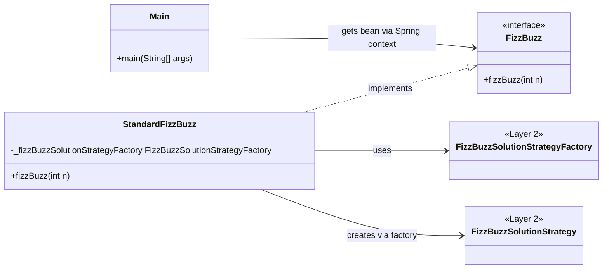

> **FR-11:** `main()` calls `fizzBuzz(N)` — entry point shown here.

---

##### Layer 2 — Solution Strategy

*`StandardFizzBuzz` (Layer 1) resolves a `FizzBuzzSolutionStrategy` through the factory. `EnterpriseGradeFizzBuzzSolutionStrategy` implements that strategy and creates the loop infrastructure (Layer 3).*

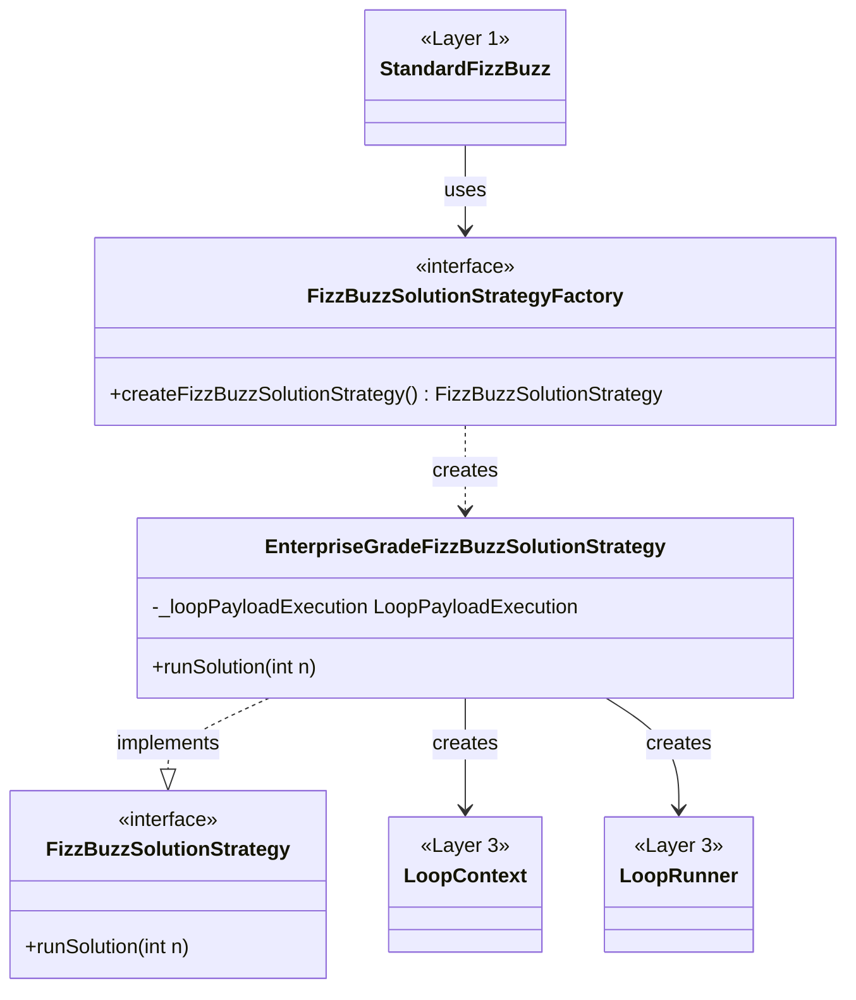

---

##### Layer 3 — Loop

*`LoopContext` implements both the state-manipulation and state-retrieval interfaces and holds the loop control components. It opens a **second Spring `ApplicationContext`** at construction to retrieve `LoopComponentFactory`, then closes it immediately — a Service Locator anti-pattern. `LoopRunner` drives the loop using the state interfaces.*

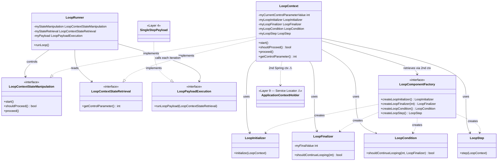

> **FR-01, FR-02:** `LoopRunner` iterates i = 1..N in order, producing exactly N iterations.

---

##### Layer 4 — Payload / Adapter

*`SingleStepPayload` is called once per iteration by `LoopRunner`. It wraps the current loop state in an adapter to conform to the `SingleStepOutputGenerationParameter` interface consumed by the output generation strategy (Layer 5).*

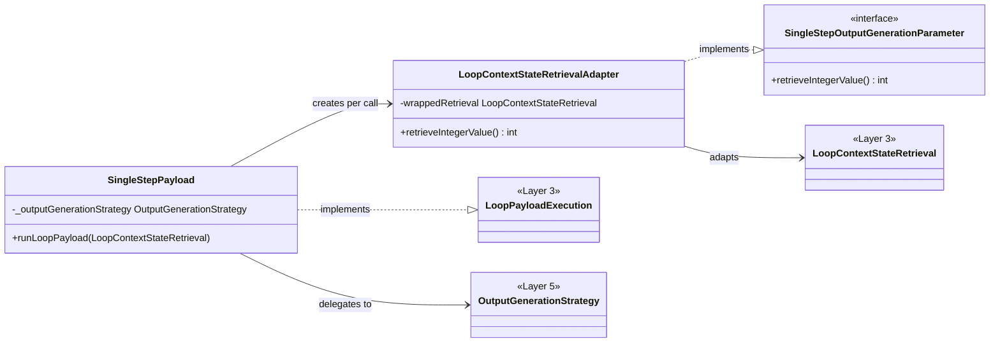

---

##### Layer 5 — Output Generation

*`SingleStepOutputGenerationStrategy` holds three `FizzBuzzOutputGenerationContext` instances (Fizz, Buzz, NoFizzNoBuzz) and a `NewLineStringPrinter`. For each iteration it passes each context to the visitor, then emits the line separator.*

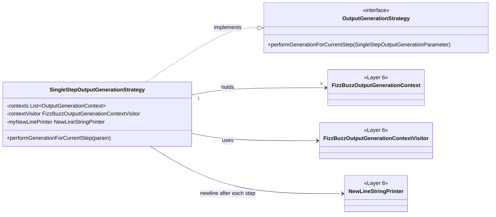

> **FR-07, FR-08:** `newLinePrinter` emits the platform line separator after each iteration's tokens.

---

##### Layer 6 — Visitor Pattern

*The visitor (`FizzBuzzOutputGenerationContextVisitor`) calls each context's `getStrategy().isEvenlyDivisible(i)`. If true, it calls `getPrinter().printValue(i)` to emit the token.*

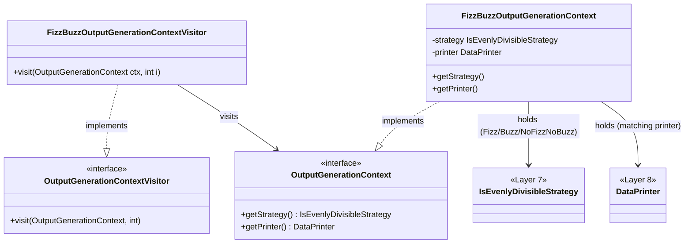

> **FR-03, FR-04, FR-05, FR-06:** Each context pairs a divisibility strategy with its corresponding printer, yielding Fizz, Buzz, FizzBuzz, or integer output.

---

##### Layer 7 — Divisibility Strategies

*Each strategy implements `isEvenlyDivisible(i)` by delegating to `NumberIsMultipleOfAnotherNumberVerifier` (Layer 9) with the appropriate divisor. `NoFizzNoBuzzStrategy` fires only when neither 3 nor 5 divides i.*

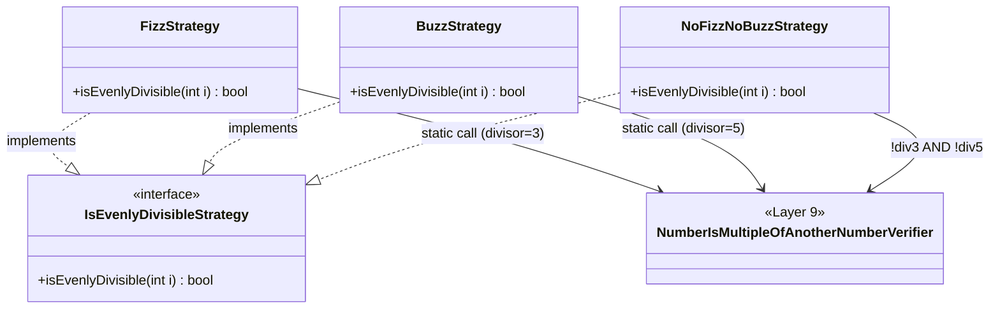

> **SR-08:** Divisibility is computed via integer division + multiplication check — equivalent to `i % d == 0` for all positive d.

---

##### Layer 8 — Printers & String Returners

*Each concrete printer retrieves its token string from a paired `StringReturner`, creates an `ExceptionSafeOutputStrategy` adapter (Layer 10), and calls `output(string)`. The `IntegerIntegerPrinter` uses `Integer.toString(i)` instead of a fixed string.*

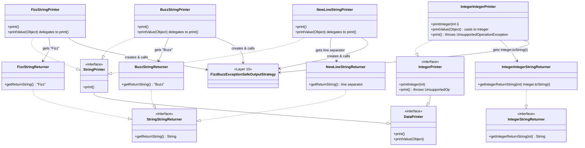

> **FR-03–FR-06, FR-08:** Token strings originate here. `NewLineStringReturner` returns `System.getProperty("line.separator")`, satisfying FR-08.

---

##### Layer 9 — Math & Service Locator

*`NumberIsMultipleOfAnotherNumberVerifier` uses `@PostConstruct init()` to retrieve `IntegerDivider` from `ApplicationContextHolder` — a Service Locator anti-pattern. Divisibility: `divide(a, b) * b == a`.*

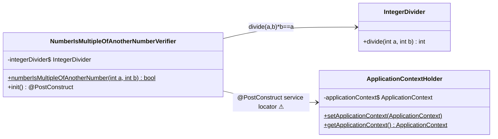

> **SR-08:** `divide(a,b) * b == a` is arithmetically equivalent to `a % b == 0` for all positive b.

---

##### Layer 10 — Output Channel

*`SystemOutFizzBuzzOutputStrategy` writes bytes to `System.out` and flushes after each call. `FizzBuzzOutputStrategyAdapter` (full name: `FizzBuzzOutputStrategyToFizzBuzzExceptionSafeOutputStrategyAdapter`) wraps it and silently swallows any `IOException`.*

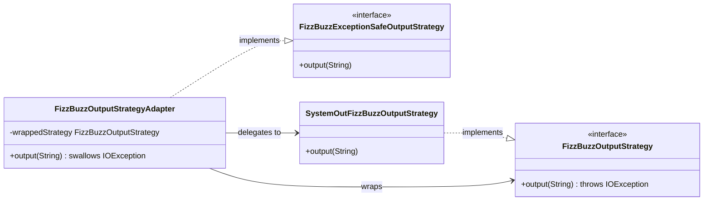

> **SR-01:** `FizzBuzzOutputStrategyAdapter` swallows `IOException` — it never propagates to the caller.
> **SR-04:** `SystemOutFizzBuzzOutputStrategy.output()` calls `System.out.write(bytes)` then `System.out.flush()` — one flush per token.
> **SR-07:** `fizzBuzz()` declares no checked exceptions because the adapter absorbs them.

---

#### 1.1.3 Printer & Output Chain Detail

This diagram shows the complete path a token string travels from a divisibility decision to bytes on `System.out`.

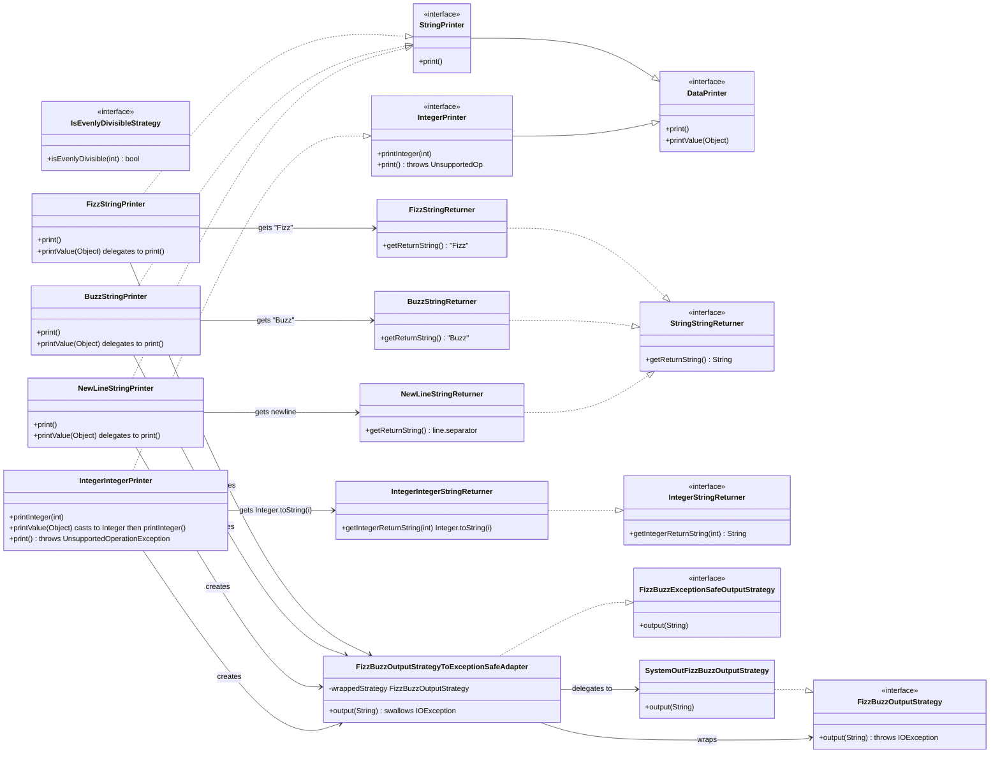

---

### 1.2 Use Cases

#### 1.2.1 Use Case Inventory

| ID | Use Case | Primary Actor | Preconditions | Postconditions | Notes |
|----|----------|--------------|---------------|----------------|-------|
| UC-01 | Run FizzBuzz (1..N) | User/Operator | JRE available; JAR on filesystem | FizzBuzz output for 1..N written to stdout | Invoked via `java -jar` — **NFR-08** |
| UC-02 | Run FizzBuzz for arbitrary N | Developer / Test caller | Spring context active | FizzBuzz output for 1..N written to stdout | Invoked via `StandardFizzBuzz.fizzBuzz(N)` — **FR-11** |
| UC-03 | Validate FizzBuzz correctness | Automated Test Harness | Spring context available; System.out redirected | All 16 assertions pass; System.out restored | `FizzBuzzTest.testFizzBuzz()` — **FR-12, NFR-04, NFR-05, NFR-06** |
| UC-04 | Add a new FizzBuzz rule (e.g., "Bazz" for multiples of 7) | Developer | Existing codebase | New rule produces correct output without modifying existing classes | Enabled by Strategy + Factory + Visitor — Open/Closed Principle |

#### 1.2.2 Use Case Diagram

> **Fix applied:** Actors are now positioned above the System Boundary via invisible edges (`~~~`) that force them into a horizontal row. (DY annotation: Developer and Test Harness were rendering inside the boundary, making the graph excessively wide.)

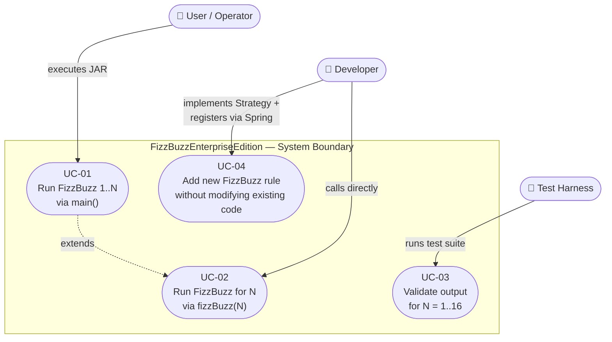

---

### 1.3 Sequence Diagrams

#### 1.3.1 Full Execution Flow

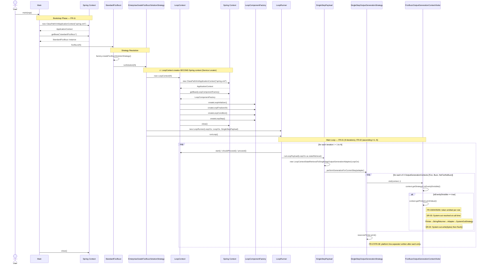

---

#### 1.3.2 Per-Iteration Step Detail (i = 15 → "FizzBuzz")

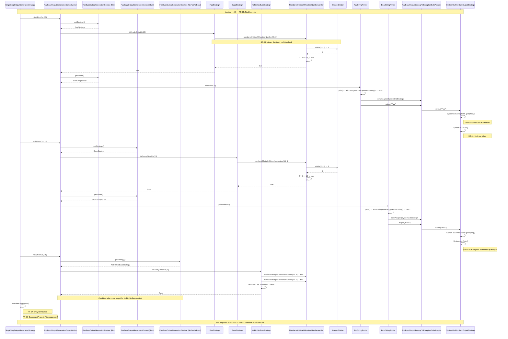

---

## 2. Post-Refactor System

The post-refactor system contains **1 Java source file** (`FizzBuzz.java`) with no external framework dependencies. All logic resides in a single `static` method.

---

### 2.1 UML Class Diagram

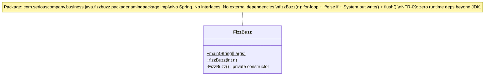

---

### 2.2 Use Cases

#### 2.2.1 Use Case Inventory

| ID | Use Case | Primary Actor | Preconditions | Postconditions | Change from Pre-Refactor |
|----|----------|--------------|---------------|----------------|--------------------------|
| UC-01 | Run FizzBuzz (1..N) | User/Operator | JRE available; JAR on filesystem | FizzBuzz output for 1..N written to stdout | None — same behavior (**NFR-08**) |
| UC-02 | Run FizzBuzz for arbitrary N | Developer / Test caller | None (no framework required) | FizzBuzz output for 1..N written to stdout | Simpler: direct `FizzBuzz.fizzBuzz(N)` static call (**FR-11**) |
| UC-03 | Validate FizzBuzz correctness | Automated Test Harness | System.out redirected | All 16 assertions pass; System.out restored | Spring startup eliminated; test is faster (**FR-12, NFR-04, NFR-05**) |
| ~~UC-04~~ | ~~Add new rule without modifying existing code~~ | ~~Developer~~ | — | — | **Removed.** Adding a rule now requires editing the `if/else if` chain. |

#### 2.2.2 Use Case Diagram

> **Fix applied:** Same actor-positioning fix as §1.2.2.

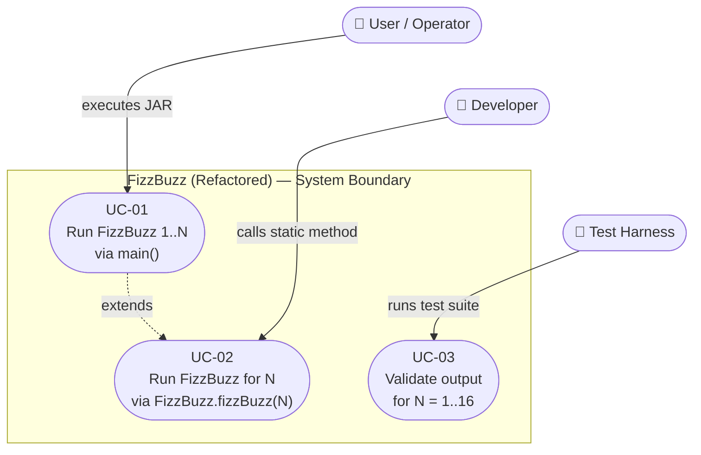

> **UC-04 removed.** The Open/Closed extensibility afforded by the Strategy pattern does not exist in the post-refactor. This is the primary extensibility trade-off documented in REQUIREMENTS_REFINED_1.md Section 5.

---

### 2.3 Sequence Diagrams

#### 2.3.1 Full Execution Flow

```mermaid
sequenceDiagram
    actor User
    participant FB as FizzBuzz
    participant SysOut as System.out

    User->>FB: main(args)
    Note over FB: FR-11: main() calls fizzBuzz(N)
    FB->>FB: fizzBuzz(N)

    Note over FB: newLine = System.getProperty("line.separator") — FR-08

    loop for i = 1 to N — FR-01 (N entries), FR-02 (ascending)
        alt i % 3 == 0 && i % 5 == 0
            FB->>FB: output = "FizzBuzz" — FR-05
        else i % 3 == 0
            FB->>FB: output = "Fizz" — FR-03
        else i % 5 == 0
            FB->>FB: output = "Buzz" — FR-04
        else
            FB->>FB: output = Integer.toString(i) — FR-06
        end

        FB->>SysOut: write((output + newLine).getBytes()) — SR-03, SR-09
        SysOut-->>FB: (written)
        FB->>SysOut: flush() — SR-04
        Note over FB,SysOut: FR-07: newline appended; SR-04: flush per entry
    end
```

---

#### 2.3.2 Per-Iteration Step Detail (i = 15)

> **Fix applied:** Long `Note over` text split into two shorter notes to prevent clipping. (DY annotation: `Note over` statement was clipping outside its rectangle.)

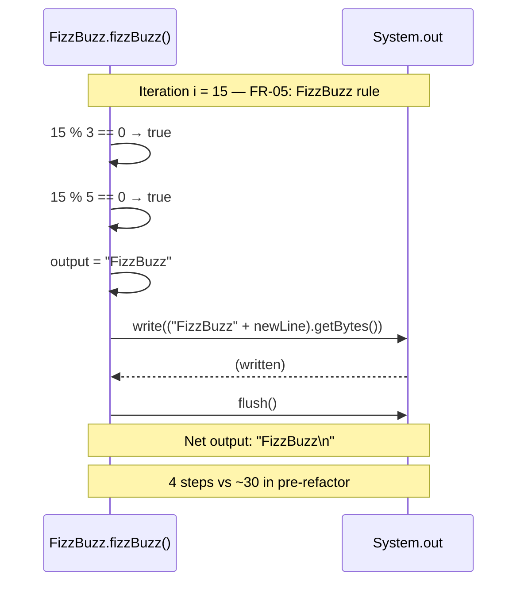

---

## 3. Architectural Comparison

### 3.1 Structural Contrast

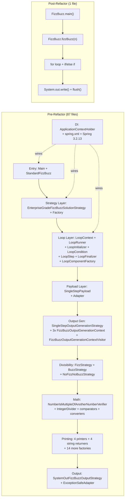

> *FR-15, FR-19, FR-20:* Class count, package depth, and runtime dependencies collapse from 10 layers spanning 87 files to a 4-step single file.

### 3.2 Pattern Inventory Comparison

| Pattern | Pre-Refactor | Post-Refactor |
|---------|-------------|---------------|
| Strategy | 7 implementations | 0 |
| Factory | 15 factory classes | 0 |
| Visitor | `FizzBuzzOutputGenerationContextVisitor` visits 3 contexts | 0 |
| Adapter | 2 adapters (ExceptionSafe output, LoopContextRetrieval→SingleStepParam) | 0 |
| Dependency Injection | Spring 3.2.13 (`@Service`, `@Autowired`, `spring.xml`) | 0 |
| Service Locator (anti-pattern) | `ApplicationContextHolder` + 2nd Spring context in `LoopContext` | 0 |
| Template Method | `LoopRunner`'s for-loop template (init/condition/step/finalize) | 0 |
| Comparator | `ThreeWayIntegerComparator`, integer/double comparators | 0 |
| **Total named patterns** | **8+** | **0** |

> *FR-22:* DI annotations (`@Service`, `@Autowired`, `@PostConstruct`) count from 80+ pre-refactor to 0 post-refactor.

### 3.3 Call Depth Comparison (for a single output token, e.g., "Fizz")

```mermaid
graph TD
    subgraph pre2 ["Pre-Refactor call depth: ~14 frames"]
        A1["main()"] --> A2["fizzBuzz(n)"] --> A3["runSolution(n)"] --> A4["runLoop()"]
        A4 --> A5["runLoopPayload(stateRetrieval)"]
        A5 --> A6["performGenerationForCurrentStep(adapter)"]
        A6 --> A7["visit(context, i)"]
        A7 --> A8["isEvenlyDivisible(i)"]
        A8 --> A9["numberIsMultipleOfAnotherNumber(i, 3)"]
        A9 --> A10["divide(i, 3)"]
        A10 --> A11["printValue(i)"] --> A12["print()"]
        A12 --> A13["output(string)"] --> A14["System.out.write(bytes)"]
    end

    subgraph post2 ["Post-Refactor call depth: 3 frames"]
        B1["main()"] --> B2["fizzBuzz(n)"] --> B3["System.out.write(bytes)"]
    end
```

> *FR-16:* The reduction from ~14 frames to 3 directly corresponds to the cyclomatic complexity reduction measured by PMD.

---

## 4. Requirements Traceability Matrix

This matrix maps every requirement in REQUIREMENTS_REFINED_1.md to the diagram(s) in this document that represent it. Diagram IDs reference section numbers.

**Diagram ID legend:**

| ID | Diagram | Section |
|----|---------|---------|
| D-1 | Architecture Overview | §1.1.1 |
| D-2 | Layer 1 — Entry Point | §1.1.2 |
| D-3 | Layer 2 — Solution Strategy | §1.1.2 |
| D-4 | Layer 3 — Loop | §1.1.2 |
| D-5 | Layer 4 — Payload/Adapter | §1.1.2 |
| D-6 | Layer 5 — Output Generation | §1.1.2 |
| D-7 | Layer 6 — Visitor Pattern | §1.1.2 |
| D-8 | Layer 7 — Divisibility Strategies | §1.1.2 |
| D-9 | Layer 8 — Printers & String Returners | §1.1.2 |
| D-10 | Layer 9 — Math & Service Locator | §1.1.2 |
| D-11 | Layer 10 — Output Channel | §1.1.2 |
| D-12 | Printer & Output Chain Detail | §1.1.3 |
| D-13 | Pre-Refactor Use Case Diagram | §1.2.2 |
| D-14 | Pre-Refactor Full Execution Flow | §1.3.1 |
| D-15 | Pre-Refactor Per-Iteration Detail | §1.3.2 |
| D-16 | Post-Refactor Class Diagram | §2.1 |
| D-17 | Post-Refactor Use Case Diagram | §2.2.2 |
| D-18 | Post-Refactor Full Execution Flow | §2.3.1 |
| D-19 | Post-Refactor Per-Iteration Detail | §2.3.2 |
| D-20 | Structural Contrast | §3.1 |
| D-21 | Pattern Inventory Table | §3.2 |
| D-22 | Call Depth Comparison | §3.3 |

---

### Functional Requirements

| Req. ID | Brief Description | Representing Diagrams | Coverage |
|---------|-------------------|-----------------------|----------|
| FR-01 | Exactly N entries for `fizzBuzz(N)` | D-14 (loop note), D-18 (loop note) | Partial — loop structure shown; cardinality assertion not visually enforced |
| FR-02 | Entries in ascending order i=1..N | D-14 (ascending loop), D-18 (ascending loop) | Partial — loop direction shown; ordering constraint implicit |
| FR-03 | Fizz for i%3==0 && i%5!=0 | D-8, D-14, D-15, D-18, D-19 | Full |
| FR-04 | Buzz for i%5==0 && i%3!=0 | D-8, D-14, D-15, D-18, D-19 | Full |
| FR-05 | FizzBuzz for i%3==0 && i%5==0 | D-15 (i=15), D-19 (i=15), D-14, D-18 | Full |
| FR-06 | Integer string for all other i | D-8 (NoFizzNoBuzz + IntegerPrinter), D-9, D-15, D-18, D-19 | Full |
| FR-07 | Entry termination with line separator | D-6, D-14, D-15, D-18 | Partial — newline emission shown; no-trailing-content constraint implicit |
| FR-08 | `System.getProperty("line.separator")` not hardcoded | D-9 (NewLineStringReturner), D-15, D-18, D-19 | Full |
| FR-09 | Empty output for N=0 | None | **None** — see §5 |
| FR-10 | No preamble before first entry | None | **None** — see §5 |
| FR-11 | `main()` calls `fizzBuzz(N)` | D-2, D-13, D-14, D-17, D-18 | Full |
| FR-12 | Oracle conformance for N=1..16 | D-13 (UC-03), D-17 (UC-03) | Partial — use case captures intent; exact oracle strings are in `TestConstants.java` |
| FR-13 | Post-refactor JaCoCo coverage ≥ pre | None | **None** — measurement requirement; see §5 |
| FR-14 | Lines-of-code measurement | None | **None** — measurement requirement; see §5 |
| FR-15 | Class and interface count | D-20, D-21 | Partial — structural contrast and pattern table show class count qualitatively |
| FR-16 | Cyclomatic complexity measurement | D-22 (call depth proxy) | Partial — call depth is a proxy; PMD-measured cyclomatic complexity not directly diagrammed |
| FR-17 | Build time measurement | None | **None** — measurement requirement; see §5 |
| FR-18 | Test execution time measurement | None | **None** — measurement requirement; see §5 |
| FR-19 | Package depth measurement | D-20 (structural contrast note) | Partial — depth reduction noted qualitatively |
| FR-20 | Runtime dependency count | D-21 (Spring row) | Partial — Spring presence/absence shown; JAR count not diagrammed |
| FR-21 | Public method count measurement | None | **None** — measurement requirement; see §5 |
| FR-22 | DI annotation count | D-21 (DI row), D-4 (LoopContext note) | Partial — annotation elimination noted; exact count not diagrammed |

### Semantic Requirements

| Req. ID | Brief Description | Representing Diagrams | Coverage |
|---------|-------------------|-----------------------|----------|
| SR-01 | IOException swallowed by adapter | D-11, D-12, D-15 | Full |
| SR-02 | Call independence (no observable cross-call state) | None | **None** — see §5 |
| SR-03 | `System.out` resolved at call time, not construction | D-14, D-15, D-18 (sequence notes) | Partial — sequence shows runtime call; captured at construction not diagrammed |
| SR-04 | `flush()` after every write (per-entry) | D-11, D-14, D-15, D-18, D-19 | Full |
| SR-05 | No side effects beyond `System.out` | None | **None** — see §5 |
| SR-06 | Determinism for given N and line.separator | None | **None** — see §5 |
| SR-07 | `fizzBuzz()` throws no exceptions | D-11, D-12 (ExceptionSafeAdapter absorbs IOException) | Full |
| SR-08 | Divisibility equivalent to `i % d == 0` | D-8, D-10, D-15 (divide+multiply sequence) | Full |
| SR-09 | Charset: `String.getBytes()` default charset | None | **None** — see §5 |

### Non-Functional Requirements

| Req. ID | Brief Description | Representing Diagrams | Coverage |
|---------|-------------------|-----------------------|----------|
| NFR-01 | Maven build succeeds | None | **None** — build/process requirement; see §5 |
| NFR-02 | Gradle build succeeds | None | **None** — build/process requirement; see §5 |
| NFR-03 | Java 1.7 language target | None | **None** — compiler config; see §5 |
| NFR-04 | JUnit 4 test framework | D-13 (UC-03), D-17 (UC-03) | Partial — test harness actor shown; framework version not diagrammed |
| NFR-05 | 16 test cases (N=1..16) | D-13 (UC-03: N=1..16), D-17 | Partial |
| NFR-06 | `System.setOut()` capture mechanism | None | **None** — test implementation detail; see §5 |
| NFR-07 | JaCoCo plugin during `mvn test` | None | **None** — build plugin config; see §5 |
| NFR-08 | Runnable JAR via `java -jar` | D-13 (UC-01), D-17 (UC-01) | Partial — UC-01 captures the intent |
| NFR-09 | No runtime deps beyond JDK (post-refactor) | D-16 (class diagram note), D-21 (Spring row) | Partial |
| NFR-10 | All changes on `ai-refactor-experiment` branch | None | **None** — process/VCS requirement; see §5 |

---

## 5. Unrepresented Requirements

The following requirements have no representation in any diagram in this document. They are grouped by the reason they are not diagrammable.

### 5.1 Measurement / Process Requirements

These requirements specify *what data to collect* and *how to compare it*, not structural or behavioral properties of the system. They are inherently process-oriented and are fully captured in PLAN_REVISED_1.md (Phases 0–4).

| Req. ID | Description | Why Not Diagrammable |
|---------|-------------|----------------------|
| FR-13 | Post-refactor JaCoCo coverage ≥ pre-refactor | Coverage percentage is a measurement outcome, not a structural property |
| FR-14 | Lines-of-code measurement (cloc) | LOC is a numeric measurement, not a behavioral or structural relationship |
| FR-16 | Cyclomatic complexity (PMD) | CC is a computed metric; call-depth diagram (D-22) is only a proxy |
| FR-17 | Build time (median of 3 `mvn clean package` runs) | Build time is a process measurement |
| FR-18 | Test execution time (median of 3 `mvn test` runs) | Test execution time is a process measurement |
| FR-21 | Public method count | Method count is a numeric measurement; class diagrams show methods but do not assert a count |

### 5.2 Behavioral Invariants (Negative or Absence Constraints)

These requirements define what a system must *not* do, or that a property holds across all possible states. Such invariants cannot be expressed in a structural or flow diagram without dedicated formal notation (e.g., OCL, TLA+).

| Req. ID | Description | Why Not Diagrammable |
|---------|-------------|----------------------|
| FR-09 | Empty output for N=0 | Edge-case behavioral assertion; no diagram shows the N=0 path |
| FR-10 | No preamble before first entry | An absence constraint — diagrams show what the system *does*, not what it omits |
| SR-02 | Call independence (no observable cross-call state) | Requires reasoning across multiple call invocations; not representable in a single-call diagram |
| SR-05 | No side effects beyond `System.out` | An absence constraint — no diagram can exhaustively show what the system does not do |
| SR-06 | Determinism for given N and line.separator | Requires quantification over all possible executions, not a single trace |

### 5.3 Implementation / Configuration Requirements

These requirements describe build system configuration, test infrastructure, or process controls that are not part of the system's runtime behavior.

| Req. ID | Description | Why Not Diagrammable |
|---------|-------------|----------------------|
| SR-09 | Charset: `String.getBytes()` without explicit charset | An implementation-level encoding detail; no natural diagram representation |
| NFR-01 | Maven build system | Build tooling, not system architecture |
| NFR-02 | Gradle build system | Build tooling, not system architecture |
| NFR-03 | Java 1.7 language target | Compiler flag, not system structure |
| NFR-06 | `System.setOut()` / `ByteArrayOutputStream` capture mechanism | Test infrastructure detail |
| NFR-07 | JaCoCo plugin configuration | Build plugin, not system structure |
| NFR-10 | All changes on `ai-refactor-experiment` branch | Version-control process requirement |

---

## 6. Change Log from VISUAL_AIDS_INITIAL

| Section | Change | Reason |
|---------|--------|--------|
| §1.1.1 | Architecture Overview retained unchanged | DY annotation: retain for completeness |
| §1.1.2 | **NEW** — Per-Layer Class Diagrams (Layers 1–10) added | DY annotation: dense overview diagram needs supplemental per-layer views |
| §1.2.2 | Use case diagram: added `User ~~~ Dev ~~~ QA` invisible edges | DY annotation: Developer and Test Harness rendered inside System Boundary, making graph excessively wide |
| §2.2.2 | Post-refactor use case diagram: same actor-positioning fix applied | Consistency with §1.2.2 fix |
| §2.3.2 | `Note over FB,SysOut: Net output...` split into two shorter notes | DY annotation: single long `Note over` statement clipped outside its rectangle |
| §1.3.1 | Added requirement annotations (`Note` statements) to sequence diagrams | DY annotation: no traceability to requirements in diagrams |
| §1.3.2 | Added requirement annotations to per-iteration sequence diagram | Same as above |
| §2.3.1 | Added requirement annotations to post-refactor sequence diagram | Same as above |
| §4 | **NEW** — Requirements Traceability Matrix | DY annotation: no way to trace whether requirements are satisfied as visual design artifacts |
| §5 | **NEW** — Unrepresented Requirements listing | User request: identify requirements not represented in any diagram |
